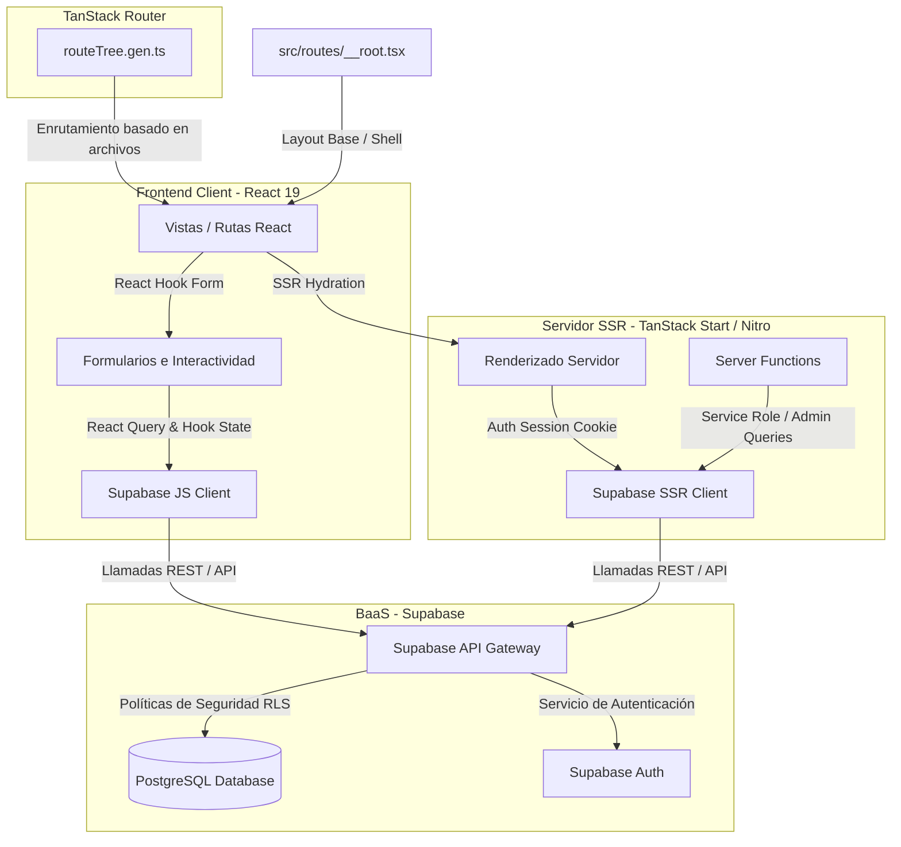

# OMVITAL - Sistema de Clínica Financiera


OMVITAL es una plataforma web integral diseñada para la gestión operativa y financiera de clínicas de salud, rehabilitación física y terapias. Su objetivo principal es centralizar y automatizar el flujo de caja, la venta y seguimiento de paquetes de terapias, y el cálculo y distribución de comisiones para médicos especialistas y promotores (referidores/jaladores).

---

## 📋 Características Clave

- **Dashboard Financiero (Bento Grid):** Resumen visual del estado de caja del día, ingresos, egresos, saldo actual, alertas de paquetes con deudas y comisiones pendientes.
- **Control de Caja:** Módulo para registro de ingresos (sesiones, paquetes, insumos) y egresos operativos, incluyendo el proceso de cierre y cuadre de caja diario.
- **Gestión de Paquetes de Terapias:** Control y seguimiento de paquetes contratados por pacientes, facturación parcial, registro de amortizaciones y control de deudas.
- **Motor de Comisiones:** Automatización del cálculo de incentivos financieros para médicos especialistas y promotores de campo (jaladores), según el origen del paciente.
- **Libro de Movimientos:** Registro centralizado e histórico de transacciones (libro contable) con capacidades de filtros multi-nivel por fecha, tipo, origen y método de pago.
- **Módulo de Trabajadores:** Catálogo unificado de personal de staff interno y referidores externos con métricas de rendimiento y comisiones acumuladas.
- **Reportes y Análisis:** Visualización de tendencias, promedios de ingresos diarios, proyección financiera de reservas e informes exportables.

---

## 🛠️ Tecnologías Utilizadas

### Frontend & Routing

- **React 19:** Biblioteca principal para la construcción de la interfaz.
- **TypeScript:** Tipado estático para robustez del código.
- **TanStack Start:** Framework full-stack para React que implementa SSR (Server-Side Rendering), hidratación de cliente y optimización de assets.
- **TanStack Router:** Enrutamiento robusto basado en archivos con seguridad de tipos (type-safe).
- **TailwindCSS v4:** Motor de estilos de última generación para una interfaz responsiva y estética premium.

### Formulación & Validación

- **React Hook Form:** Gestión eficiente de formularios.
- **Zod:** Validación de esquemas de datos tanto en cliente como en servidor.

### Visualización & UI Components

- **Radix UI:** Componentes base accesibles y sin estilos.
- **Recharts:** Biblioteca de gráficos interactivos para reportes y estadísticas.
- **Lucide React & Material Symbols:** Set de iconos limpios y modernos.
- **Sonner:** Notificaciones toast elegantes y no intrusivas.

### Backend (Capas de Servicio)

- **Nitro:** Motor de servidor ultrarrápido integrado en TanStack Start para servir la aplicación y las funciones del servidor.
- **Server Functions (`createServerFn`):** Mecanismo para invocar lógica del lado del servidor directamente desde el cliente con seguridad de tipos.

---

## 📐 Arquitectura del Sistema

El proyecto utiliza una arquitectura de **Aplicación React Full-Stack** integrada con **Supabase** como backend como servicio (BaaS) y base de datos relacional **PostgreSQL**.



### Principales Patrones e Integraciones Utilizados:

1.  **File-Based Routing:** Enrutamiento dinámico tipo-seguro administrado por TanStack Router, donde cada archivo en `src/routes/` representa una vista.
2.  **Server Functions e Integración de Servidor (SSR):** Lógica que requiere bypass de seguridad o tareas pesadas se ejecuta en el servidor mediante `createServerFn`. Se utiliza `@supabase/ssr` para compartir la sesión de autenticación del usuario mediante cookies seguras entre el servidor de renderizado y el cliente.
3.  **Seguridad RLS (Row Level Security):** La seguridad de acceso a datos se delega directamente a la base de datos PostgreSQL en Supabase. Cada consulta externa es evaluada por políticas RLS basadas en el rol o JWT del usuario autenticado.
4.  **UI Primitives (Shadcn UI):** Componentes visuales encapsulados en `src/components/ui/` que facilitan la interactividad nativa en React en reemplazo de plantillas HTML estáticas.

---

## 📂 Estructura del Proyecto

La estructura de carpetas del proyecto es la siguiente:

```text
omvital_project/
├── .git/                      # Repositorio Git
├── src/                       # Código fuente de la aplicación
│   ├── components/            # Componentes reutilizables de React
│   │   └── ui/                # Primitivas de UI (Shadcn UI / Radix)
│   ├── hooks/                 # Custom React hooks (ej. use-mobile)
│   ├── lib/                   # Utilidades y servicios generales
│   │   ├── api/               # Server Functions y llamadas a APIs
│   │   ├── config.server.ts   # Configuración exclusiva de servidor
│   │   ├── error-capture.ts   # Sistema de captura de excepciones
│   │   └── utils.ts           # Funciones de utilidad comunes
│   ├── routes/                # Rutas y páginas de la aplicación
│   │   ├── __root.tsx         # Layout principal, Sidebar y TopBar
│   │   ├── index.tsx          # Vista General (Dashboard)
│   │   ├── caja.tsx           # Gestión de Caja diaria
│   │   ├── paquetes.tsx       # Gestión de Paquetes de Terapias
│   │   ├── comisiones.tsx     # Registro y pago de Comisiones
│   │   ├── movimientos.tsx    # Libro de Movimientos Contables
│   │   ├── reportes.tsx       # Análisis y Gráficos financieros
│   │   └── trabajadores.tsx   # Directorio de Staff y Referidores
│   ├── routeTree.gen.ts       # Árbol de rutas auto-generado
│   ├── router.tsx             # Instancia y configuración del Router
│   ├── server.ts              # Entry point del servidor SSR
│   ├── start.ts               # Configuración de middleware de servidor
│   └── styles.css             # Estilos globales de la aplicación
├── bun.lock                   # Lockfile de dependencias Bun
├── bunfig.toml                # Configuración de Bun
├── components.json            # Configuración de Shadcn UI
├── eslint.config.js           # Reglas de linting del código
├── package.json               # Configuración del proyecto y dependencias
├── package-lock.json          # Lockfile de dependencias npm
├── tsconfig.json              # Configuración de TypeScript
└── vite.config.ts             # Configuración del bundler Vite
```

---

## 🚀 Instalación y Ejecución

### Requisitos Previos

- **Node.js** v18 o superior.
- **Bun** (Recomendado para desarrollo ultrarrápido) o **npm** / **yarn**.

### Pasos de Instalación

1.  **Clonar el repositorio:**

    ```bash
    git clone <url-del-repositorio>
    cd omvital_project
    ```

2.  **Instalar dependencias:**
    - Usando Bun (Recomendado):
      ```bash
      bun install
      ```
    - Usando npm:
      ```bash
      npm install
      ```

### Ejecución en Entorno de Desarrollo

Para iniciar el servidor de desarrollo local:

- Usando Bun:
  ```bash
  bun dev
  ```
- Usando npm:
  ```bash
  npm run dev
  ```

La aplicación estará disponible en [http://localhost:3000](http://localhost:3000) (o el puerto configurado por Vite).

### Construcción para Producción

Para compilar y empaquetar el proyecto para producción:

- Usando Bun:
  ```bash
  bun build
  ```
- Usando npm:
  ```bash
  npm run build
  ```

---

## 🐳 Despliegue en Producción (Docker, OCI y Cloudflare)

El proyecto está configurado para ser desplegado fácilmente en un Servidor Virtual Privado (VPS) en **Oracle Cloud Infrastructure (OCI)** utilizando **Docker Compose** y **Cloudflare** como CDN.

Para más información, consulta el informe completo de despliegue en [reporte_despliegue.md](file:///home/rikich/repos/academicos/tecn_inf/omvital_project/deploys/reporte_despliegue.md).

### Resumen del Proceso de Despliegue:

1. **Configuración de Red en Oracle Cloud (OCI):**
   - Habilite una regla de ingreso (Ingress Rule) en la VCN para permitir tráfico en el puerto `8085` (TCP).
   - Abra el puerto `8085` en el firewall de Ubuntu ejecutando:
     ```bash
     sudo iptables -I INPUT 6 -p tcp --dport 8085 -j ACCEPT
     sudo apt-get install iptables-persistent -y
     sudo netfilter-persistent save
     ```

2. **Configuración en Cloudflare:**
   - Cree un registro de tipo **A** apuntando a la IP de su servidor con el **Proxy (Nube Naranja)** activo.
   - Configure el modo de SSL/TLS en **Flexible** o **Full (Strict)**.

3. **Ejecución de Contenedores:**
   - Clone el repositorio en su servidor VPS.
   - Inicie los servicios utilizando Docker Compose:
     ```bash
     sudo docker compose -f deploys/docker-compose.yml up -d --build
     ```
   - Esto levantará el contenedor de la aplicación Bun (puerto interno 3000) y un contenedor de Nginx que actúa como proxy inverso y está expuesto en el puerto host `8085`.

---

## 👥 Integrantes del Equipo y Distribución de Trabajo

### Equipo de Sistemas Distribuidos

- **Tony** (Desarrollador / Documentación)
- **Fernando** (Desarrollador Frontend)
- **Pedro** (Arquitecto de Base de Datos y Backend)
- **Dennis** (Desarrollador Backend / APIs)
- **Luis** (Ingeniero de Calidad y Pruebas)

### Equipo de Tecnologías de la Información

- **Ricardo** (Diseñador UX/UI / Frontend)
- **Jhonatan** (Desarrollador Backend / Integración)
- **Tony** (Soporte Técnico / Frontend)
- **Fernando** (Desarrollador Core / DevOps)
- **Luis** (Testing / Base de Datos)

### 📋 Distribución Detallada por Roles Clave (Integración con Supabase)

- **Diseño de Base de Datos (SQL, Migraciones y Esquemas):**
  - **Pedro (Sistemas Distribuidos):** Responsable de montar la base de datos PostgreSQL en Supabase, ejecutar el esquema inicial del archivo [schema.sql](file:///C:/Users/luisg/OneDrive/Documentos/Universidad/7MO/TecDeLaInformacion/ProjectFinal/omvital_project/database/schema.sql), diseñar índices de búsqueda y crear scripts de datos semilla para el desarrollo local.
- **Integración de Supabase (Cliente, Servidor, SSR y Auth):**
  - **Dennis (Sistemas Distribuidos):** Encargado de configurar los clientes cliente/servidor de Supabase, manejar el flujo de login/logout, guardar la sesión en cookies seguras utilizando `@supabase/ssr` y proteger el acceso de rutas.
- **CRUDs (Lógica de Negocio en Front y Back):**
  - **Pedro y Dennis (Sistemas Distribuidos - Backend):** Creación de las Server Functions (`caja.functions.ts`, `paquetes.functions.ts`, `comisiones.functions.ts`, `trabajadores.functions.ts`) que hacen el fetch/mutation a Supabase.
  - **Ricardo y Jhonatan (Tecnologías de la Información - Frontend):** Refactorizar el HTML estático de las páginas de Caja, Paquetes, Comisiones y Trabajadores a React JSX, enlazando los formularios mediante `react-hook-form` y disparando llamadas a base de datos.
- **Dashboard:**
  - **Tony (Ambos Equipos):** Refactorización del archivo `index.tsx`. Conectar las tarjetas de balance general e ingresos del día a consultas en tiempo real de Supabase mediante TanStack Query.
- **Reportes y Analítica:**
  - **Jhonatan (Tecnologías de la Información):** Conversión de la página `reportes.tsx` a React JSX, sustitución de gráficos maquetados por componentes visuales interactivos de `recharts` que calculan sumatorias de transacciones agregadas directamente desde Supabase.
- **DevOps, Compilación CSS y Configuración de Despliegue SSR:**
  - **Fernando (Ambos Equipos):** Responsable de la compilación local estática y optimización de TailwindCSS v4 en Vite para eliminar dependencias de CDNs externas, y configuración de empaquetado final del servidor Nitro para entornos de despliegue en la nube (SSR).
- **Testing y Aseguramiento de Calidad:**
  - **Luis (Ambos Equipos):** Construcción de pruebas unitarias con Vitest y validación del correcto funcionamiento de las políticas RLS en Supabase para proteger los datos médicos y financieros.

---

## 🌿 Flujo de Trabajo en Git

Para asegurar un desarrollo ordenado y libre de conflictos, el proyecto implementa una metodología basada en **GitFlow Simplificado**.

### Estructura de Ramas:

- `main`: Rama de producción. Solo código estable y verificado.
- `develop`: Rama de integración de características.
- `feature/<nombre>-<funcionalidad>`: Ramas de trabajo individuales para nuevas características.
- `bugfix/<nombre>-<error>`: Ramas para corrección rápida de errores.

### Flujo Recomendado de Pull Requests:

1.  **Crear rama local:** Partiendo siempre desde `develop`.
    ```bash
    git checkout develop
    git pull origin develop
    git checkout -b feature/pedro-conexion-db
    ```
2.  **Trabajar y Commitear:** Escribir código atómico con mensajes claros en español.
3.  **Mantenerse actualizado:** Realizar `git pull origin develop` frecuentemente en tu rama y resolver conflictos localmente.
4.  **Subir y Abrir PR:** Subir la rama a GitHub y abrir un Pull Request hacia `develop`. Requiere la aprobación de al menos otro desarrollador antes del Merge.
5.  **Merge a develop:** Una vez aprobado, se realiza el merge y se elimina la rama remota del feature.

---

## 📄 Licencia

Este proyecto es para uso académico exclusivo en los cursos de **Sistemas Distribuidos** y **Tecnologías de la Información**, 7mo Semestre. Todos los derechos reservados.
