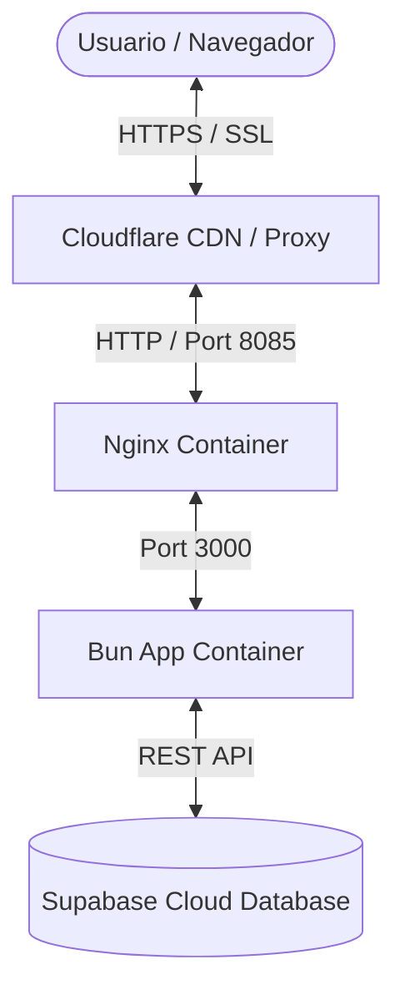

# Informe de Despliegue - OMVITAL

Este informe detalla la arquitectura, requerimientos y pasos necesarios para desplegar la aplicación **OMVITAL** en un Servidor Virtual Privado (VPS) en **Oracle Cloud Infrastructure (OCI)** utilizando **Docker Compose** y **Cloudflare** como Red de Distribución de Contenidos (CDN) y proveedor de seguridad/DNS.

---

## 1. Arquitectura de Despliegue

La solución utiliza una pila contenerizada de alto rendimiento basada en **Bun** y **Nginx**:



- **Cloudflare (Edge/CDN):** Administra el certificado SSL/TLS (HTTPS), protege contra ataques de denegación de servicio (DDoS), cachea elementos estáticos y oculta la dirección IP pública del VPS de Oracle.
- **Nginx (Reverse Proxy):** Recibe las peticiones HTTP redirigidas de Cloudflare, restaura la IP real del cliente, maneja la compresión Gzip en tránsito y redirige el tráfico al contenedor de la aplicación.
- **Bun Application (Node-less runtime):** Ejecuta el servidor SSR compilado de TanStack Start directamente con el runtime de Bun.
- **Supabase (Database SaaS):** Aloja de forma remota el motor PostgreSQL y gestiona las transacciones de datos.

---

## 2. Configuración en Oracle Cloud (OCI)

Para ejecutar la aplicación en Oracle Cloud con Ubuntu Server, siga estas pautas para la máquina virtual y la red.

### A. Recursos Recomendados (Capa Gratuita / Always Free)

- **Instancia:** VM.Standard.A1.Flex (Procesador ARM Ampere, recomendado de 1 a 4 OCPUs y de 6 a 24 GB de RAM) o VM.Standard.E2.1.Micro (AMD, 1 GB RAM - _suficiente pero más ajustada_).
- **Sistema Operativo:** Ubuntu Server 22.04 LTS o 24.04 LTS.

### B. Reglas de Ingress en la VCN (Virtual Cloud Network)

En la consola web de OCI, debe permitir el tráfico entrante a su VPS.

1. Diríjase a **Networking** > **Virtual Cloud Networks** > **[Nombre de su VCN]** > **Security Lists**.
2. Añada la siguiente **Ingress Rule (Regla de Entrada)**:
   - **Source CIDR:** `0.0.0.0/0`
   - **IP Protocol:** `TCP`
   - **Destination Port Range:** `8085` (Si usa Cloudflare con SSL Flexible/Origin en puerto 8085) y `443` (opcional, para SSL Full si se mapea).
   - **Description:** HTTP para Nginx / Cloudflare.

### C. Firewall Interno de Ubuntu (Paso Crítico en Oracle Cloud)

Las imágenes por defecto de Ubuntu en OCI vienen con reglas de `iptables` estrictas que bloquean los puertos 80 y 443 incluso si se abren en la consola web de Oracle. Ejecute los siguientes comandos en la terminal de la instancia VPS para abrirlos:

```bash
# Permitir tráfico HTTP en el puerto 8085 en iptables
sudo iptables -I INPUT 6 -p tcp --dport 8085 -j ACCEPT

# Guardar las reglas para que persistan tras reiniciar
sudo apt-get install iptables-persistent -y
sudo netfilter-persistent save
```

---

## 3. Configuración en Cloudflare

Cloudflare actúa como la puerta de enlace segura y optimizador de velocidad para tu aplicación.

### A. Configuración DNS

1. En el panel de Cloudflare, agregue su dominio (ej. `omvital.com`).
2. Cree un registro **A** que apunte a la dirección IP pública de su VPS de Oracle Cloud:
   - **Type:** `A`
   - **Name:** `@` (o el subdominio elegido como `app`)
   - **IPv4 address:** `[IP_PUBLICA_DEL_VPS]`
   - **Proxy status:** **Proxied (Nube Naranja)**. _Es fundamental mantener el proxy activo para aprovechar la CDN y ocultar el servidor._

### B. Configuración de SSL/TLS

Dependiendo del nivel de encriptación que requiera entre Cloudflare y su VPS:

1.  **Flexible (Recomendado por simplicidad inicial):**
    - La comunicación Navegador $\leftrightarrow$ Cloudflare es HTTPS (segura).
    - La comunicación Cloudflare $\leftrightarrow$ VPS es HTTP (Puerto 8085).
    - _Ventaja:_ No necesita instalar certificados SSL en el VPS ni en Nginx.
2.  **Full (Estricto - Recomendado para producción real):**
    - Descargue un **Origin Certificate** gratuito desde la sección SSL/TLS de Cloudflare.
    - Instálelo en el VPS y configure Nginx para escuchar en el puerto 443 con HTTPS.
    - La comunicación de extremo a extremo está completamente encriptada.

---

## 4. Guía de Despliegue en el VPS (Paso a Paso)

Siga este procedimiento una vez conectado por SSH al VPS de Oracle:

### Paso 1: Instalar dependencias

Actualice el sistema e instale Docker:

```bash
sudo apt update && sudo apt upgrade -y
sudo apt install -y docker.io docker-compose-v2
sudo systemctl enable --now docker
```

### Paso 2: Clonar y Preparar el Directorio del Proyecto

Transfiera o clone los archivos de su proyecto en el VPS (por ejemplo, en `/var/www/omvital`).
Asegúrese de contar con la carpeta `deploys` que contiene:

- `deploys/Dockerfile`
- `deploys/docker-compose.yml`
- `deploys/nginx.conf`

### Paso 3: Crear el Archivo de Entorno `.env`

En la raíz del proyecto en el VPS, cree el archivo `.env` con las variables de producción para la base de datos de Supabase:

```bash
nano .env
```

Copie y complete las siguientes variables con sus credenciales operativas de Supabase:

```env
SUPABASE_URL=https://pudsbrahsvpwtpecalcj.supabase.co
SUPABASE_ANON_KEY=sb_publishable_hj8OvtCmO8qHIqHaVdWRqA_QQBJgE9P
SUPABASE_SERVICE_ROLE_KEY=eyJhbGciOiJIUzI1NiIsInR5cCI6IkpXVCJ9...
```

### Paso 4: Levantar los Contenedores

Ejecute Docker Compose desde el directorio raíz del proyecto para construir la imagen del contenedor de Bun y arrancar Nginx de forma aislada:

```bash
# Levantar servicios en segundo plano (--build obliga a recrear la imagen)
sudo docker compose -f deploys/docker-compose.yml up -d --build
```

### Paso 5: Monitorear el Estado

Para comprobar que el contenedor de la aplicación Bun y Nginx están corriendo sin errores:

```bash
# Ver estado de los contenedores
sudo docker compose -f deploys/docker-compose.yml ps

# Revisar logs del servidor Bun
sudo docker compose -f deploys/docker-compose.yml logs -f app
```

---

## 5. Optimizaciones de Nginx incluidas en la Configuración

- **Restauración de IP real (`real_ip_header CF-Connecting-IP`):** Cloudflare actúa como proxy inverso, por lo que sin esta directiva, todos los registros de acceso (`access.log`) verían la IP de Cloudflare en lugar de la del visitante real.
- **Caché agresivo de Assets (`/assets/`):** Todos los archivos de JavaScript compilado, CSS, fuentes e imágenes estáticas servidos por TanStack Start se cachean en el navegador por 365 días (`expires 365d; Cache-Control "public"`), reduciendo el consumo de ancho de banda del VPS.
- **Compresión Gzip Activa:** Configurado para comprimir JSON, HTML, CSS y JS al vuelo. Esto acelera notablemente la velocidad de carga de la SPA/SSR en conexiones móviles lentas.
